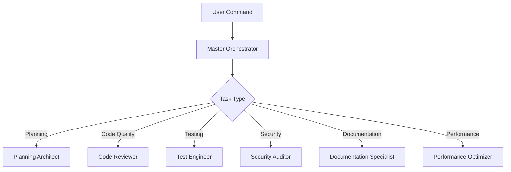

# Complete Usage Guide

This comprehensive guide covers all aspects of using the Claude Code Project Template, from basic operations to advanced workflows and integrations.

## Table of Contents

1. [Core Concepts](#core-concepts)
2. [Sub-Agent System](#sub-agent-system)
3. [Custom Commands](#custom-commands)
4. [Automation & Hooks](#automation--hooks)
5. [Development Workflows](#development-workflows)
6. [Best Practices](#best-practices)
7. [Advanced Features](#advanced-features)

## Core Concepts

### Project Structure

The template organizes your project into a clean, scalable structure:

```
my-project/
├── src/                    # Source code
│   └── project_name/       # Main package
│       ├── agents/         # Sub-agent implementations
│       ├── core/           # Core business logic
│       └── utils/          # Utility functions
├── tests/                  # Test suite
│   ├── unit/              # Unit tests
│   └── integration/       # Integration tests
├── docs/                   # Documentation
│   ├── guides/            # User guides
│   └── examples/          # Example projects
├── CLAUDE.md              # AI context file
└── hooks/                 # Automation hooks
```

### CLAUDE.md - The AI Context File

The `CLAUDE.md` file is your project's AI brain. It contains:
- Project overview and vision
- Coding standards and conventions
- Architecture decisions
- Development guidelines
- Custom instructions for Claude

Update this file to shape how Claude understands and works with your project.

## Sub-Agent System

### How Sub-Agents Work

Sub-agents are specialized AI assistants that handle specific aspects of development:



### Sub-Agent Capabilities

#### 1. Master Orchestrator
- Coordinates multi-agent workflows
- Breaks down complex tasks
- Manages agent communication
- Ensures task completion

**Example Usage:**
```bash
> /project:plan Build a RESTful API with authentication, database, and deployment
```

#### 2. Planning Architect
- Technical design and architecture
- System design documents
- API specifications
- Database schemas

**Triggered by:**
- `/project:plan`
- `/dev:feature` (initial planning phase)

#### 3. Code Reviewer
- Code quality assurance
- Best practices enforcement
- Security vulnerability detection
- Performance issue identification

**Triggered by:**
- `/dev:review`
- Automatic on commits (via hooks)

#### 4. Test Engineer
- Test strategy development
- Unit test generation
- Integration test creation
- Test coverage analysis

**Triggered by:**
- `/dev:test`
- Automatic after feature implementation

#### 5. Security Auditor
- Security vulnerability scanning
- Compliance checking
- Dependency auditing
- Security best practices

**Triggered by:**
- `/security:audit`
- `/security:scan`
- Automatic on sensitive changes

#### 6. Documentation Specialist
- API documentation
- Code documentation
- User guides
- Architecture diagrams

**Triggered by:**
- `/project:docs`
- Automatic after major changes

#### 7. Performance Optimizer
- Performance profiling
- Optimization suggestions
- Resource usage analysis
- Scalability improvements

**Triggered by:**
- `/dev:refactor` with performance focus
- Manual performance reviews

## Custom Commands

### Development Commands

#### `/dev:feature <description>`
Implements a complete feature with planning, coding, testing, and documentation.

```bash
> /dev:feature Add user profile management with avatar upload
```

**Process:**
1. Planning Architect designs the feature
2. Implementation with best practices
3. Test Engineer creates tests
4. Documentation Specialist updates docs
5. Code Reviewer validates quality

#### `/dev:review [file/directory]`
Performs comprehensive code review.

```bash
> /dev:review src/auth/
```

**Checks:**
- Code quality and style
- Security vulnerabilities
- Performance issues
- Best practices
- Test coverage

#### `/dev:test [component]`
Creates or updates tests.

```bash
> /dev:test UserService
```

**Generates:**
- Unit tests
- Integration tests
- Edge case tests
- Performance tests

#### `/dev:debug <issue>`
Intelligent debugging assistance.

```bash
> /dev:debug API returns 500 on user creation
```

**Actions:**
- Analyzes error logs
- Traces execution flow
- Identifies root cause
- Suggests fixes
- Implements solution

#### `/dev:refactor <target>`
Refactors code for better quality.

```bash
> /dev:refactor src/utils/ for better performance
```

**Improvements:**
- Code structure
- Performance optimization
- Readability
- Maintainability

### Project Commands

#### `/project:plan <description>`
Creates comprehensive project plans.

```bash
> /project:plan E-commerce platform with payments
```

**Delivers:**
- Architecture design
- Technology stack
- Development phases
- Timeline estimates

#### `/project:status`
Shows current project status.

```bash
> /project:status
```

**Reports:**
- Development progress
- Test coverage
- Documentation status
- Open issues

#### `/project:docs [component]`
Generates project documentation.

```bash
> /project:docs API
```

**Creates:**
- API documentation
- Architecture diagrams
- Setup guides
- Usage examples

#### `/project:deploy [environment]`
Prepares deployment configuration.

```bash
> /project:deploy production
```

**Configures:**
- Environment variables
- Docker containers
- CI/CD pipelines
- Infrastructure as code

### Git Commands

#### `/git:commit [message]`
Smart git commits with conventional messages.

```bash
> /git:commit
```

**Features:**
- Analyzes changes
- Generates semantic message
- Follows conventions
- Includes context

#### `/git:pr [title]`
Creates pull requests with detailed descriptions.

```bash
> /git:pr Add authentication system
```

**Includes:**
- Change summary
- Testing checklist
- Documentation updates
- Review guidelines

#### `/git:release <version>`
Manages version releases.

```bash
> /git:release v1.2.0
```

**Process:**
- Updates version numbers
- Generates changelog
- Creates release notes
- Tags repository

#### `/git:hotfix <issue>`
Quick fixes for production issues.

```bash
> /git:hotfix Fix login timeout
```

**Workflow:**
- Creates hotfix branch
- Implements fix
- Runs tests
- Prepares for merge

### Security Commands

#### `/security:audit`
Comprehensive security audit.

```bash
> /security:audit
```

**Analyzes:**
- Code vulnerabilities
- Dependency risks
- Configuration issues
- Best practices

#### `/security:scan [target]`
Targeted security scanning.

```bash
> /security:scan src/auth/
```

**Checks:**
- SQL injection
- XSS vulnerabilities
- Authentication flaws
- Encryption issues

#### `/security:compliance <standard>`
Compliance checking.

```bash
> /security:compliance OWASP
```

**Validates:**
- Security standards
- Industry compliance
- Best practices
- Regulatory requirements

## Automation & Hooks

### Auto-Approval System

The template includes smart auto-approval for safe commands:

**Auto-Approved Commands:**
- `ls`, `pwd`, `echo`
- `git status`, `git diff`
- `grep`, `find`
- `python --version`
- Read-only operations

**Benefits:**
- 90%+ faster development
- No interruptions for safe operations
- Focus on important decisions

### Hook System

Hooks automate repetitive tasks and maintain quality:

#### Pre-Commit Hooks
- Code formatting (Black, Prettier)
- Linting (Ruff, ESLint)
- Type checking (mypy)
- Security scanning

#### Post-Command Hooks
- Test execution
- Documentation updates
- Sub-agent triggering
- Quality checks

#### Custom Hooks

Create custom hooks in the `hooks/` directory:

```python
# hooks/pre-feature.py
def pre_feature_hook(feature_description):
    """Run before feature implementation"""
    # Check feature requirements
    # Validate against roadmap
    # Prepare environment
    pass
```

## Development Workflows

### Feature Development Workflow

1. **Plan the Feature**
   ```bash
   > /dev:feature User notification system
   ```

2. **Review Implementation**
   ```bash
   > /dev:review src/notifications/
   ```

3. **Ensure Test Coverage**
   ```bash
   > /dev:test NotificationService
   ```

4. **Document the Feature**
   ```bash
   > /project:docs notifications
   ```

5. **Commit Changes**
   ```bash
   > /git:commit
   ```

### Bug Fixing Workflow

1. **Debug the Issue**
   ```bash
   > /dev:debug Users can't reset passwords
   ```

2. **Implement Fix**
   - Claude identifies and fixes the issue

3. **Add Regression Tests**
   ```bash
   > /dev:test PasswordReset regression
   ```

4. **Create Hotfix**
   ```bash
   > /git:hotfix Password reset fix
   ```

### Refactoring Workflow

1. **Analyze Current Code**
   ```bash
   > /dev:review src/legacy/
   ```

2. **Plan Refactoring**
   ```bash
   > /project:plan Refactor legacy authentication
   ```

3. **Execute Refactoring**
   ```bash
   > /dev:refactor src/legacy/auth/
   ```

4. **Verify Tests Pass**
   - Automated via hooks

### Documentation Workflow

1. **Generate API Docs**
   ```bash
   > /project:docs API
   ```

2. **Create User Guides**
   ```bash
   > /project:docs user-guide
   ```

3. **Update Architecture**
   ```bash
   > /project:docs architecture
   ```

## Best Practices

### 1. Leverage Sub-Agents

- Use specialized agents for their expertise
- Let agents collaborate on complex tasks
- Trust agent recommendations
- Review agent outputs for learning

### 2. Command Usage

- Use custom commands over manual implementation
- Chain commands for complex workflows
- Let auto-approval speed up development
- Customize commands for your needs

### 3. Code Quality

- Follow the coding standards in CLAUDE.md
- Let hooks maintain consistency
- Use `/dev:review` regularly
- Implement suggested improvements

### 4. Testing Strategy

- Write tests alongside features
- Use `/dev:test` for comprehensive coverage
- Run tests automatically via hooks
- Maintain high coverage standards

### 5. Security First

- Run security audits regularly
- Address vulnerabilities immediately
- Keep dependencies updated
- Follow security best practices

### 6. Documentation

- Keep documentation current
- Use `/project:docs` after major changes
- Document architecture decisions
- Create examples for complex features

## Advanced Features

### Multi-Agent Workflows

Complex tasks automatically trigger multiple agents:

```bash
> /project:plan Microservices migration

# Triggers:
# 1. Planning Architect - Architecture design
# 2. Security Auditor - Security implications
# 3. Test Engineer - Testing strategy
# 4. Documentation Specialist - Migration guide
```

### Context-Aware Development

Claude remembers your project context:
- Previous decisions
- Coding patterns
- Architecture choices
- Team preferences

### Intelligent Suggestions

The system proactively suggests:
- Performance improvements
- Security enhancements
- Code refactoring
- Test additions

### Custom Agent Creation

Add new specialized agents:

```python
# src/agents/custom_agent.py
class DataScienceAgent(BaseAgent):
    """Specialized agent for data science tasks"""
    
    def analyze_data(self, dataset):
        # Custom data analysis logic
        pass
```

### Integration Options

#### CI/CD Integration
- GitHub Actions
- GitLab CI
- Jenkins
- CircleCI

#### IDE Integration
- VS Code extension
- JetBrains plugin
- Vim integration
- Emacs support

#### Monitoring Integration
- Error tracking (Sentry)
- Performance monitoring (Datadog)
- Logging (ELK stack)
- Metrics (Prometheus)

## Troubleshooting Common Issues

For detailed troubleshooting, see the [Troubleshooting Guide](troubleshooting.md).

### Quick Fixes

1. **Command Not Working**
   - Check command syntax
   - Verify project initialization
   - Update Claude Code CLI

2. **Sub-Agent Not Triggering**
   - Check hook configuration
   - Verify agent availability
   - Review CLAUDE.md settings

3. **Tests Failing**
   - Run `/dev:debug test-failure`
   - Check test environment
   - Verify dependencies

## Conclusion

The Claude Code Project Template transforms how you develop software by combining:
- Intelligent automation
- Specialized expertise
- Consistent quality
- Rapid development

Master these tools and workflows to achieve unprecedented productivity and code quality in your projects.