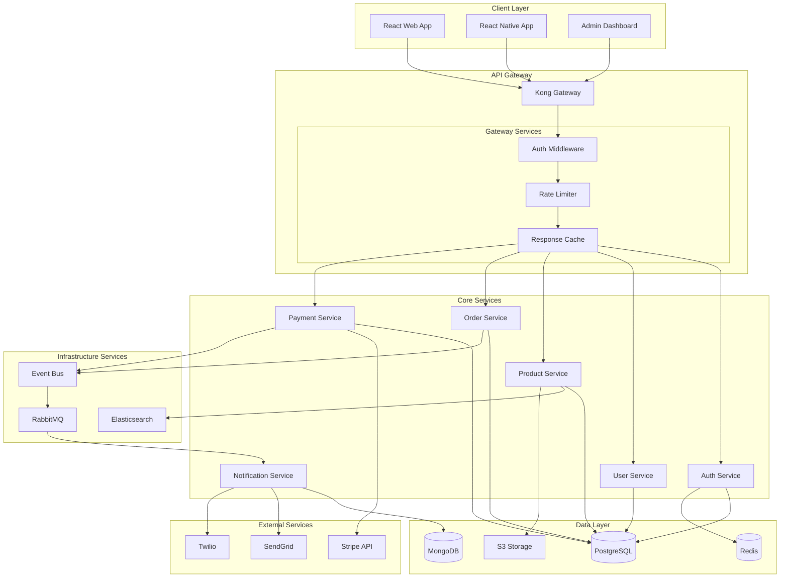
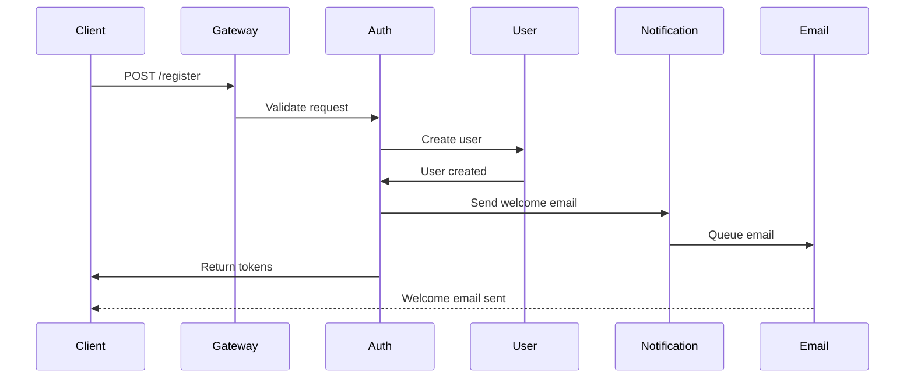
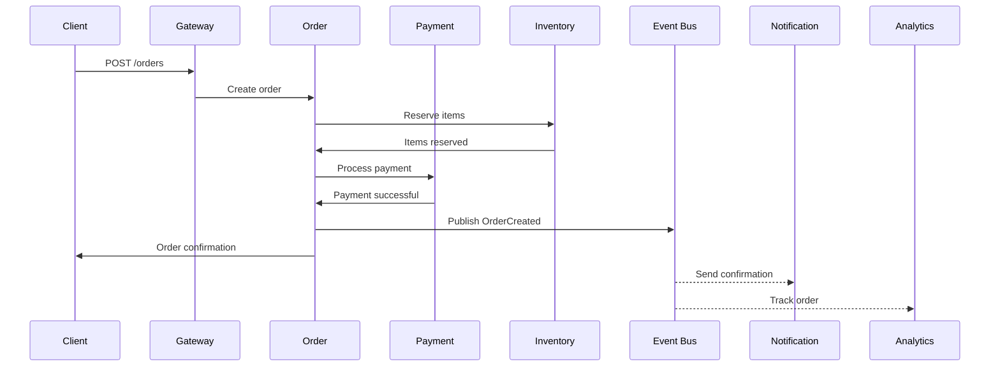

# /project:docs

Generates comprehensive project documentation including API references, user guides, and architecture diagrams.

## Usage
`/project:docs [type] [component]`

## Description
Triggers the Documentation Specialist to create or update project documentation, ensuring comprehensive coverage of all aspects of the system.

## Documentation Types

### 1. API Documentation
- OpenAPI/Swagger specs
- Endpoint references
- Request/response examples
- Authentication guides

### 2. User Documentation
- Getting started guides
- Feature tutorials
- FAQ sections
- Troubleshooting guides

### 3. Developer Documentation
- Architecture overviews
- Setup instructions
- Contribution guidelines
- Code examples

### 4. Operations Documentation
- Deployment guides
- Monitoring setup
- Incident response
- Maintenance procedures

## Examples

### Generate All Documentation
```
/project:docs
```

### API Documentation Only
```
/project:docs api
```

### User Guide for Feature
```
/project:docs user-guide authentication
```

### Architecture Documentation
```
/project:docs architecture
```

## Documentation Outputs

### API Documentation (OpenAPI)
```yaml
openapi: 3.0.0
info:
  title: MyApp API
  version: 1.0.0
  description: |
    MyApp provides a comprehensive API for managing e-commerce operations.
    
    ## Authentication
    All API requests require authentication using JWT tokens.
    
    ## Rate Limiting
    API requests are limited to 100 requests per minute per user.
    
  contact:
    name: API Support
    email: api@myapp.com
    url: https://support.myapp.com
  
  license:
    name: MIT
    url: https://opensource.org/licenses/MIT

servers:
  - url: https://api.myapp.com/v1
    description: Production server
  - url: https://staging-api.myapp.com/v1
    description: Staging server

security:
  - bearerAuth: []

paths:
  /auth/login:
    post:
      summary: User login
      operationId: login
      tags:
        - Authentication
      security: []
      requestBody:
        required: true
        content:
          application/json:
            schema:
              type: object
              required:
                - email
                - password
              properties:
                email:
                  type: string
                  format: email
                  example: user@example.com
                password:
                  type: string
                  format: password
                  minLength: 8
            examples:
              valid:
                value:
                  email: user@example.com
                  password: securePassword123
      responses:
        '200':
          description: Login successful
          content:
            application/json:
              schema:
                $ref: '#/components/schemas/AuthTokens'
              examples:
                success:
                  value:
                    access_token: eyJhbGciOiJIUzI1NiIs...
                    refresh_token: eyJhbGciOiJIUzI1NiIs...
                    token_type: Bearer
                    expires_in: 3600
        '401':
          $ref: '#/components/responses/Unauthorized'
        '429':
          $ref: '#/components/responses/TooManyRequests'

  /products:
    get:
      summary: List products
      operationId: listProducts
      tags:
        - Products
      parameters:
        - name: page
          in: query
          schema:
            type: integer
            default: 1
            minimum: 1
        - name: limit
          in: query
          schema:
            type: integer
            default: 20
            maximum: 100
        - name: category
          in: query
          schema:
            type: string
          example: electronics
        - name: sort
          in: query
          schema:
            type: string
            enum: [price_asc, price_desc, name, created_at]
            default: created_at
      responses:
        '200':
          description: Product list
          content:
            application/json:
              schema:
                type: object
                properties:
                  data:
                    type: array
                    items:
                      $ref: '#/components/schemas/Product'
                  pagination:
                    $ref: '#/components/schemas/Pagination'

components:
  schemas:
    Product:
      type: object
      required:
        - id
        - name
        - price
      properties:
        id:
          type: string
          format: uuid
        name:
          type: string
          maxLength: 255
        description:
          type: string
        price:
          type: number
          format: decimal
          minimum: 0
        category:
          type: string
        images:
          type: array
          items:
            type: string
            format: uri
        inventory:
          type: integer
          minimum: 0
        created_at:
          type: string
          format: date-time
```

### User Guide
```markdown
# MyApp User Guide

## Table of Contents
1. [Getting Started](#getting-started)
2. [Account Management](#account-management)
3. [Product Catalog](#product-catalog)
4. [Shopping Cart](#shopping-cart)
5. [Checkout Process](#checkout-process)
6. [Order Tracking](#order-tracking)
7. [Troubleshooting](#troubleshooting)

## Getting Started

### Creating an Account

1. **Navigate to Sign Up**
   - Click the "Sign Up" button in the top right corner
   - Or visit https://myapp.com/signup

2. **Enter Your Information**
   - Email address (will be your username)
   - Password (minimum 8 characters)
   - Full name
   - Phone number (optional)

3. **Verify Your Email**
   - Check your inbox for verification email
   - Click the verification link
   - You'll be redirected to login

### First-time Setup

After logging in for the first time:

1. **Complete Your Profile**
   - Add shipping address
   - Set communication preferences
   - Upload profile picture (optional)

2. **Payment Methods**
   - Add credit/debit card
   - Link PayPal account
   - Set default payment method

## Product Catalog

### Browsing Products

#### Search Functionality
- **Search Bar**: Enter keywords, product names, or SKUs
- **Auto-suggestions**: See popular searches as you type
- **Advanced Search**: Click the filter icon for detailed options

#### Filtering Options
- **Category**: Electronics, Clothing, Home, etc.
- **Price Range**: Use the slider or enter specific values
- **Brand**: Select one or multiple brands
- **Ratings**: Filter by customer ratings
- **Availability**: In stock, shipping time

#### Product Details
Click on any product to view:
- High-resolution images with zoom
- Detailed specifications
- Customer reviews and ratings
- Related products
- Availability and shipping info

### Managing Favorites

1. **Add to Favorites**
   - Click the heart icon on any product
   - Access favorites from your account menu

2. **Organize Lists**
   - Create custom lists (e.g., "Birthday Gifts")
   - Share lists with friends and family
   - Set price alerts

## Shopping Cart

### Adding Items
- Click "Add to Cart" from product page
- Select quantity and variations (size, color)
- Continue shopping or proceed to checkout

### Cart Management
- **Update Quantities**: Use +/- buttons
- **Remove Items**: Click the trash icon
- **Save for Later**: Move items to wishlist
- **Apply Coupons**: Enter code in promo field

### Cart Features
- **Price Breakdown**: See subtotal, tax, shipping
- **Shipping Calculator**: Estimate delivery costs
- **Stock Alerts**: Notification if items go out of stock

## Checkout Process

### Step 1: Shipping Information
- Select saved address or add new
- Choose shipping speed
- Add special delivery instructions

### Step 2: Payment Method
- Select payment option
- Enter card details (secured with SSL)
- Option to save for future use

### Step 3: Review Order
- Verify all details
- Apply gift cards or store credit
- Accept terms and conditions

### Step 4: Confirmation
- Receive order number
- Email confirmation sent
- Track order immediately

## Order Tracking

### Track Your Order
1. Go to "My Orders" in account menu
2. Find your order by:
   - Order number
   - Date range
   - Product name

### Order Status Updates
- **Processing**: Order received and being prepared
- **Shipped**: Package handed to carrier
- **Out for Delivery**: Package will arrive today
- **Delivered**: Package delivered to address

### Delivery Options
- **Standard**: 5-7 business days
- **Express**: 2-3 business days
- **Next Day**: Order by 2 PM for next day
- **Store Pickup**: Available at select locations

## Troubleshooting

### Common Issues

#### Can't Log In
1. Check email/password spelling
2. Use "Forgot Password" link
3. Clear browser cache
4. Try different browser

#### Payment Declined
- Verify card details
- Check expiration date
- Ensure billing address matches
- Contact your bank
- Try different payment method

#### Order Not Received
1. Check tracking information
2. Verify shipping address
3. Check with neighbors
4. Contact carrier
5. File claim with support

### Contact Support

#### Live Chat
- Available 24/7
- Click chat bubble on any page
- Average response time: 2 minutes

#### Email Support
- support@myapp.com
- Response within 24 hours
- Include order number

#### Phone Support
- 1-800-MYAPP-01
- Monday-Friday: 8 AM - 8 PM EST
- Saturday-Sunday: 10 AM - 6 PM EST

## Mobile App

### Download
- [iOS App Store](https://apps.apple.com/myapp)
- [Google Play Store](https://play.google.com/myapp)

### Mobile Features
- Push notifications for orders
- Barcode scanning
- Mobile-exclusive deals
- Touch ID/Face ID login
- Offline browsing
```

### Architecture Documentation
```markdown
# System Architecture

## Overview

MyApp follows a microservices architecture pattern with event-driven communication, designed for scalability, reliability, and maintainability.

## Architecture Diagram



## Service Descriptions

### Auth Service
**Responsibility**: Authentication and authorization
**Technology**: Python/FastAPI
**Database**: PostgreSQL, Redis (sessions)
**Key Features**:
- JWT token management
- OAuth2 integration
- Role-based access control
- Session management

### Product Service
**Responsibility**: Product catalog management
**Technology**: Python/FastAPI
**Database**: PostgreSQL, Elasticsearch
**Key Features**:
- Product CRUD operations
- Search and filtering
- Inventory management
- Image processing

### Order Service
**Responsibility**: Order processing and management
**Technology**: Python/FastAPI
**Database**: PostgreSQL
**Key Features**:
- Order creation and tracking
- Cart management
- Order state machine
- Event publishing

## Data Flow Examples

### User Registration Flow


### Order Creation Flow


## Security Architecture

### Network Security
- VPC with private subnets
- WAF on API Gateway
- TLS 1.3 everywhere
- Network segmentation

### Application Security
- JWT with short expiry
- API key rotation
- Input validation
- SQL injection prevention
- XSS protection

### Data Security
- Encryption at rest
- Encryption in transit
- PII tokenization
- Secure key management
- Regular security audits

## Scalability Patterns

### Horizontal Scaling
- Stateless services
- Load balancers
- Auto-scaling groups
- Read replicas

### Caching Strategy
- Redis for sessions
- CDN for static assets
- API response caching
- Database query caching

### Performance Optimization
- Database indexing
- Query optimization
- Lazy loading
- Connection pooling
```

### README Template
```markdown
# MyApp

[](https://github.com/myapp/myapp/actions)
[](https://codecov.io/gh/myapp/myapp)
[](LICENSE)

Modern e-commerce platform built with microservices architecture.

## Features

- 🛍️ Complete e-commerce functionality
- 🔐 Secure authentication with JWT
- 💳 Multiple payment options
- 📦 Real-time order tracking
- 🔍 Advanced search with Elasticsearch
- 📱 Mobile-responsive design
- 🚀 High performance and scalability

## Quick Start

### Prerequisites
- Python 3.12+
- PostgreSQL 15+
- Redis 7+
- Docker & Docker Compose

### Local Development

1. Clone the repository
```bash
git clone https://github.com/myapp/myapp.git
cd myapp
```

2. Set up environment
```bash
cp .env.example .env
# Edit .env with your configuration
```

3. Start services
```bash
docker-compose up -d
```

4. Run migrations
```bash
python manage.py migrate
```

5. Start development server
```bash
python manage.py runserver
```

Visit http://localhost:8000

## Project Structure

```
myapp/
├── services/           # Microservices
│   ├── auth/          # Authentication service
│   ├── product/       # Product catalog
│   ├── order/         # Order management
│   └── payment/       # Payment processing
├── shared/            # Shared libraries
├── infrastructure/    # IaC and deployment
├── docs/              # Documentation
└── tests/            # Test suites
```

## Development

### Running Tests
```bash
# Unit tests
pytest tests/unit

# Integration tests
pytest tests/integration

# All tests with coverage
pytest --cov=services
```

### Code Style
```bash
# Format code
black services/

# Lint
flake8 services/
mypy services/
```

## API Documentation

API documentation is available at:
- Swagger UI: http://localhost:8000/docs
- ReDoc: http://localhost:8000/redoc

## Contributing

See [CONTRIBUTING.md](CONTRIBUTING.md) for development guidelines.

## License

MIT License - see [LICENSE](LICENSE) file.

## Support

- Documentation: https://docs.myapp.com
- Issues: https://github.com/myapp/myapp/issues
- Discord: https://discord.gg/myapp
```

## Documentation Standards

### Code Documentation
```python
"""
Module: order_service.py
Purpose: Handles order creation, processing, and management
Author: Development Team
"""

from typing import List, Optional, Dict
from decimal import Decimal

class OrderService:
    """
    Service class for managing orders.
    
    This service handles the complete order lifecycle including:
    - Order creation and validation
    - Payment processing
    - Inventory management
    - Status updates and notifications
    
    Attributes:
        db: Database connection
        payment_client: Payment service client
        event_bus: Event publishing interface
    """
    
    def create_order(
        self,
        user_id: str,
        items: List[Dict],
        shipping_address: Dict,
        payment_method: str
    ) -> Dict:
        """
        Create a new order for a user.
        
        This method orchestrates the order creation process:
        1. Validates order items and availability
        2. Calculates pricing including tax and shipping
        3. Reserves inventory
        4. Processes payment
        5. Creates order record
        6. Publishes order events
        
        Args:
            user_id: Unique identifier of the user
            items: List of order items with product_id and quantity
            shipping_address: Shipping address dictionary
            payment_method: Payment method identifier
            
        Returns:
            Dict containing order details and confirmation
            
        Raises:
            InsufficientInventoryError: If items are out of stock
            PaymentFailedError: If payment processing fails
            ValidationError: If order data is invalid
            
        Example:
            >>> service = OrderService()
            >>> order = service.create_order(
            ...     user_id="user123",
            ...     items=[{"product_id": "prod456", "quantity": 2}],
            ...     shipping_address={...},
            ...     payment_method="card_123"
            ... )
            >>> print(order["confirmation_number"])
            'ORD-2024-001234'
        """
        # Implementation
```

## Options

- `--format`: Documentation format (markdown/html/pdf)
- `--sections`: Specific sections to generate
- `--language`: Documentation language
- `--version`: API version to document

## Best Practices

### 1. Comprehensive Coverage
- Document all public APIs
- Include examples
- Explain edge cases
- Provide troubleshooting

### 2. Keep Updated
- Automate generation
- Version documentation
- Track changes
- Review regularly

### 3. User-Focused
- Clear language
- Logical organization
- Visual aids
- Quick start guides

### 4. Developer-Friendly
- Code examples
- API playground
- SDKs and libraries
- Migration guides

## Related Commands

- `/dev:feature` - Implement documented features
- `/project:plan` - Plan documentation strategy
- `/git:release` - Document releases
- `/dev:review` - Review documentation