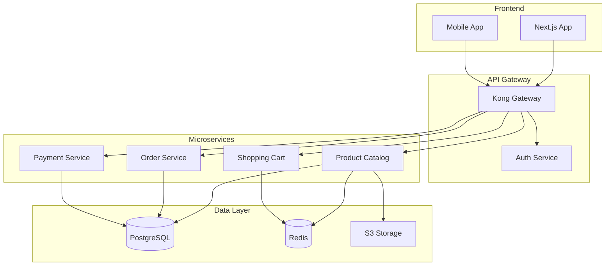

# /project:plan

Creates comprehensive project plans with architecture, implementation phases, and technical specifications.

## Usage
`/project:plan <project-description>`

## Description
Triggers the Planning Architect and Master Orchestrator to create detailed project plans, including technical architecture, implementation roadmap, and resource requirements.

## Planning Process

### 1. Requirements Analysis
- Gather functional requirements
- Identify constraints
- Define success criteria
- Assess technical feasibility

### 2. Architecture Design
- System architecture
- Technology stack selection
- Component design
- Integration strategy

### 3. Implementation Planning
- Development phases
- Task breakdown
- Timeline estimation
- Risk assessment

### 4. Resource Planning
- Team requirements
- Infrastructure needs
- Tool selection
- Budget considerations

## Examples

### Web Application
```
/project:plan "E-commerce platform with product catalog, shopping cart, payment processing, and admin dashboard"
```

### API Service
```
/project:plan "RESTful API for mobile app with user authentication, real-time notifications, and data synchronization"
```

### Microservices
```
/project:plan "Microservices architecture for order management system with event-driven communication"
```

## Planning Output

### Project Overview
```markdown
# Project: E-commerce Platform

## Executive Summary
A modern e-commerce platform supporting B2C transactions with scalable architecture and comprehensive feature set.

## Goals
- Support 100k concurrent users
- <2s page load time
- 99.9% uptime
- PCI DSS compliance

## Timeline
- Phase 1: 4 weeks (MVP)
- Phase 2: 6 weeks (Full features)
- Phase 3: 4 weeks (Optimization)
```

### Technical Architecture
```markdown
## Architecture Overview

### System Components
1. **Frontend**
   - React 18 with TypeScript
   - Next.js for SSR/SSG
   - Tailwind CSS
   - Redux Toolkit

2. **Backend**
   - Python 3.12 with FastAPI
   - PostgreSQL 15
   - Redis for caching
   - Celery for async tasks

3. **Infrastructure**
   - AWS ECS for containers
   - CloudFront CDN
   - RDS for database
   - S3 for static assets

### Architecture Diagram

```

### Implementation Phases
```markdown
## Phase 1: MVP (4 weeks)

### Week 1-2: Foundation
- [ ] Project setup and CI/CD
- [ ] Database schema design
- [ ] Authentication system
- [ ] Basic API structure

### Week 3-4: Core Features
- [ ] Product catalog API
- [ ] Shopping cart functionality
- [ ] Basic checkout flow
- [ ] Admin authentication

## Phase 2: Full Features (6 weeks)

### Week 1-2: Payment Integration
- [ ] Stripe integration
- [ ] Order processing
- [ ] Invoice generation
- [ ] Payment webhooks

### Week 3-4: User Features
- [ ] User profiles
- [ ] Order history
- [ ] Wishlist
- [ ] Product reviews

### Week 5-6: Admin Features
- [ ] Product management
- [ ] Order management
- [ ] User management
- [ ] Analytics dashboard

## Phase 3: Optimization (4 weeks)

### Week 1-2: Performance
- [ ] Database optimization
- [ ] Caching strategy
- [ ] CDN integration
- [ ] Load testing

### Week 3-4: Polish
- [ ] UI/UX improvements
- [ ] Mobile optimization
- [ ] SEO enhancements
- [ ] Documentation
```

### Technical Specifications
```markdown
## API Specification

### Authentication
- JWT tokens with refresh
- OAuth2 support (Google, Facebook)
- Rate limiting: 100 req/min
- Session timeout: 30 minutes

### Endpoints
```yaml
/api/v1:
  /auth:
    POST /login
    POST /logout
    POST /refresh
    POST /register
    
  /products:
    GET / (list with pagination)
    GET /{id}
    POST / (admin)
    PUT /{id} (admin)
    DELETE /{id} (admin)
    
  /cart:
    GET /
    POST /items
    PUT /items/{id}
    DELETE /items/{id}
    POST /checkout
    
  /orders:
    GET / (user orders)
    GET /{id}
    POST /
    PUT /{id}/status (admin)
```

### Database Schema
```sql
-- Core tables
CREATE TABLE users (
    id UUID PRIMARY KEY,
    email VARCHAR(255) UNIQUE NOT NULL,
    password_hash VARCHAR(255) NOT NULL,
    created_at TIMESTAMP DEFAULT NOW()
);

CREATE TABLE products (
    id UUID PRIMARY KEY,
    name VARCHAR(255) NOT NULL,
    description TEXT,
    price DECIMAL(10,2) NOT NULL,
    inventory INTEGER DEFAULT 0
);

CREATE TABLE orders (
    id UUID PRIMARY KEY,
    user_id UUID REFERENCES users(id),
    status VARCHAR(50) DEFAULT 'pending',
    total DECIMAL(10,2) NOT NULL,
    created_at TIMESTAMP DEFAULT NOW()
);
```
```

### Risk Assessment
```markdown
## Risk Analysis

### Technical Risks
| Risk | Impact | Probability | Mitigation |
|------|--------|-------------|------------|
| Scalability issues | High | Medium | Load testing, auto-scaling |
| Payment failures | High | Low | Retry logic, fallback providers |
| Data breach | Critical | Low | Encryption, security audits |

### Business Risks
| Risk | Impact | Probability | Mitigation |
|------|--------|-------------|------------|
| Scope creep | Medium | High | Clear requirements, change control |
| Timeline delays | Medium | Medium | Buffer time, parallel development |
```

## Options

- `--detail`: Level of detail (high/medium/low)
- `--methodology`: Development methodology (agile/waterfall)
- `--budget`: Include budget estimates
- `--team-size`: Specify team size

## Deliverables

1. **Technical Design Document**
2. **API Specification**
3. **Database Schema**
4. **Architecture Diagrams**
5. **Implementation Timeline**
6. **Risk Assessment**
7. **Resource Requirements**

## Best Practices

### 1. Realistic Planning
- Include buffer time
- Consider dependencies
- Plan for testing
- Account for reviews

### 2. Scalability First
- Design for growth
- Modular architecture
- Performance budgets
- Monitoring strategy

### 3. Security by Design
- Threat modeling
- Security controls
- Compliance requirements
- Audit trails

## Related Commands

- `/dev:feature` - Implement planned features
- `/project:status` - Track progress
- `/project:docs` - Generate documentation
- `/security:audit` - Security planning